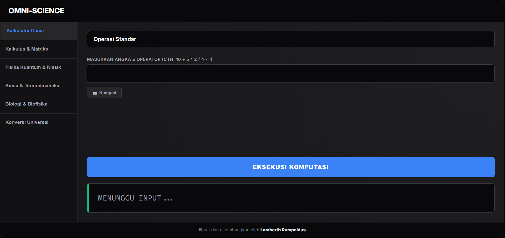

# 🌌 Omni-Science
### "Laboratorium Komputasi Sains & Kalkulus Tingkat Lanjut dalam Satu Jendela"

> **Diciptakan dengan dedikasi oleh [Lamberth Rumpaidus](https://github.com/lamberthrumpaidus)**

**Omni-Science** adalah sebuah platform komputasi saintifik berbasis web yang dirancang untuk menjadi asisten utama bagi mahasiswa, peneliti, dan penggemar sains. Dibangun dengan arsitektur **Data-Driven Dynamic UI**, aplikasi ini menawarkan perhitungan dari level aritmatika dasar hingga kalkulus dan fisika kuantum dengan performa tinggi dan antarmuka *dark mode* yang elegan.

---

## 🖼️ Tampilan Aplikasi

  
  
<i>Antarmuka premium dengan navigasi kategori sains yang lengkap</i>

---

## 🌟 Fitur Unggulan

- **🧮 Advanced Calculus Engine**: Menghitung turunan, integral tentu numerik, dan limit aproksimasi dengan sangat presisi.
- **⌨️ Smart Virtual Numpad**: Fitur *keyboard* angka interaktif (*toggle hide/show*) yang mempercepat input data tanpa harus menggunakan keyboard fisik.
- **⚡ Zero-Lag Architecture**: Seluruh *engine* komputasi berjalan di sisi klien (browser) tanpa jeda *loading* atau kebutuhan komunikasi server (*backend*).
- **🎯 Universal Output Formatting**: Bebas dari notasi eksponensial (huruf "e") yang membingungkan; hasil konversi dan perhitungan otomatis dibulatkan secara human-readable.

---

## 📚 Katalog Komputasi

| Kategori | Cakupan Fungsi & Rumus |
| :--- | :--- |
| **Kalkulator Dasar** | Operasi Standar interaktif dengan dukungan *Virtual Numpad* |
| **Kalkulus & Matriks** | Turunan f'(x), Integral Tentu (Simpson's 1/3), Limit, Determinan 3x3 |
| **Fisika Kuantum & Klasik** | Relativitas ($E=mc^2$), Dilatasi Waktu, Gravitasi Newton, Fluida Bernoulli |
| **Kimia & Termodinamika** | Energi Bebas Gibbs, Persamaan Nernst, pH Buffer Asam, Molaritas |
| **Biologi & Biofisika** | Laju Transpirasi, Cardiac Output (Curah Jantung), Energi ATP Glikolisis |
| **Konversi Universal**| Konversi Massa, Waktu, Suhu, Panjang, Biner/Desimal, Base64 |

